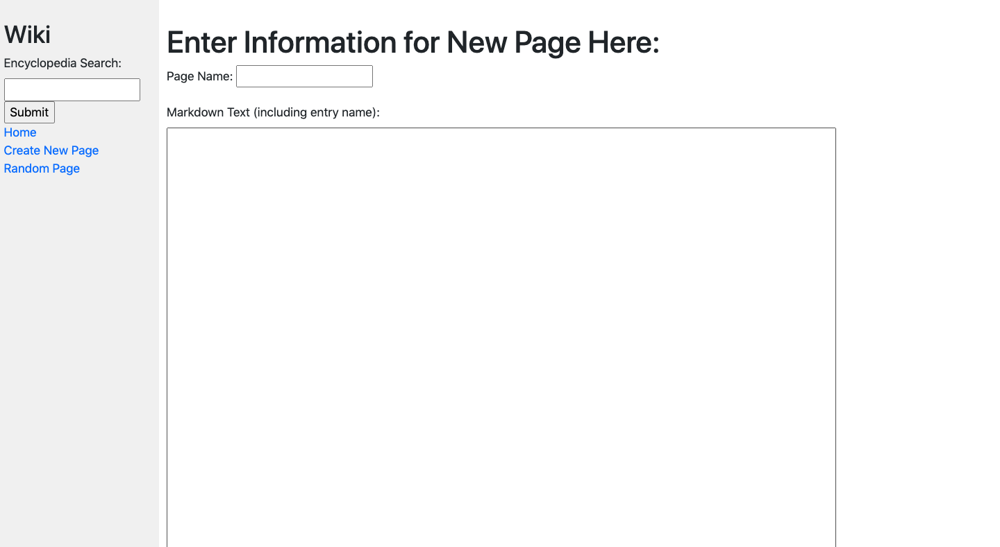
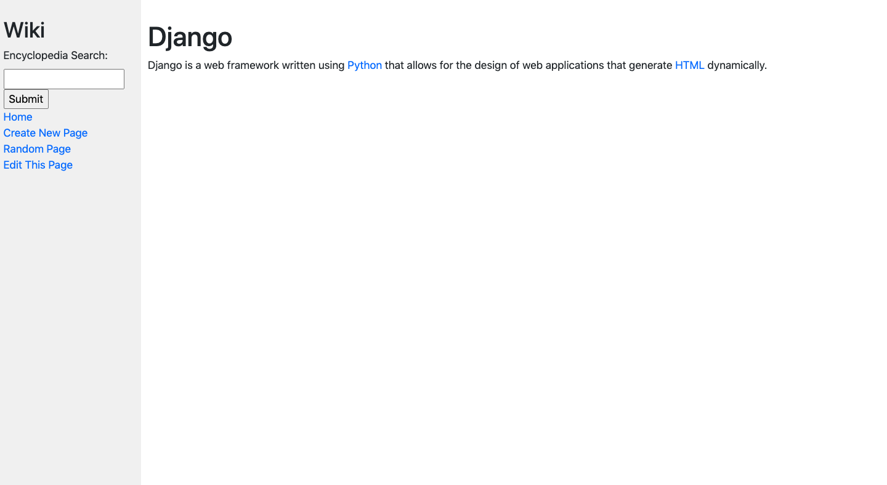
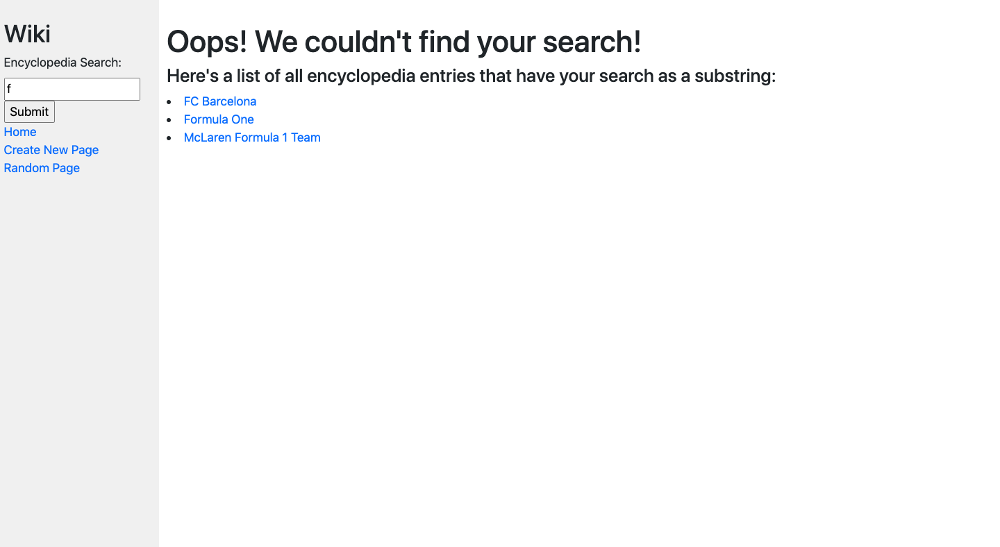

# Miniature Encyclopedia

Welcome to a little version of Wikipedia! Here, you can create, view, and edit encylopedia pages. 
All edits/entries in the encyclopedia are done with Markdown Text. [Click here](https://docs.github.com/en/github/writing-on-github/basic-writing-and-formatting-syntax#links) to see some cool features of Markdown text and how to use it!

To run the website, clone the repository and through your command line, change the working directory to this project. Then, type "python3 manage.py runserver" into the command line. You'll see something like: "Starting development server at http://127.0.0.1:8000/". Copy and paste the http:// link into your web browser, and interact with the encyclopedia!

* **Home Page**: Renders a page displaying a list of all the entries in the encyclopedia. Clicking on an entry will take you to its entry page. 
* **Entry Page**: Renders a page that displays the contents of that encyclopedia entry. If an entry is requested that does not exist, the user should be presented with an error page indicating that their requested page was not found. You can also click on Edit This Page to the left to edit the existing page.
* **Search**: Search for a page. If the page exists, you'll be taken to the page. If the page doesn't exist, you'll be presented with a list of pages that have your query as a substring.
* **Create New Page**: Click here to create a new page. You'll be able to enter a title for the page and, in a textarea, you'll be able to enter the Markdown content for the page.
* **Random Page**: Click here if you're feeling adventurous to be taken to a random encylopedia page!

 
P.S.: If you're looking for an entry to insert into the encyclopedia page, feel free to take this one ;)
 
"#Jawad
 
A computer science student always looking to further progress his skills. A hard worker, Jawad will fit in well at any internship."
 

Here's some examples of what the page looks like:

